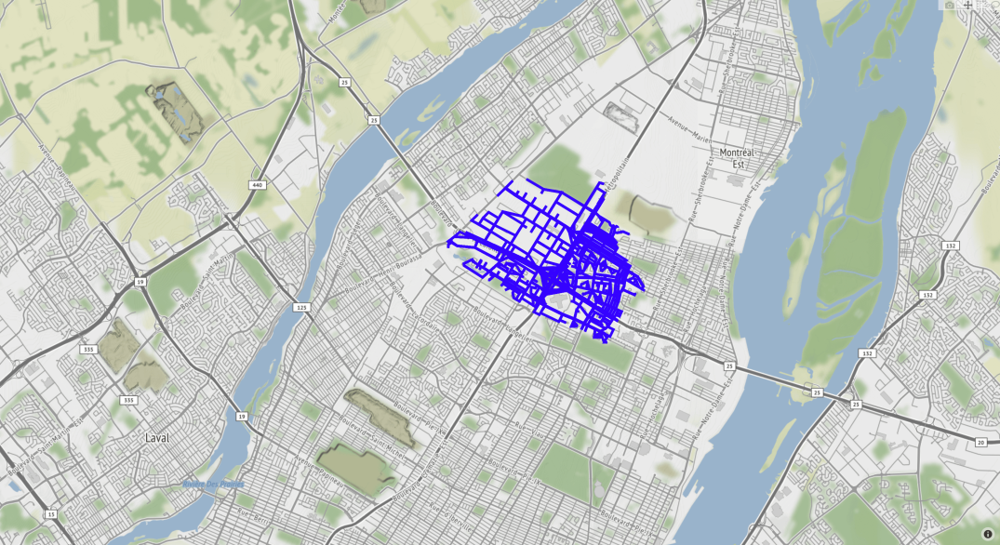

# Chinese postman solver
The goal of this project is to calculate a path to clear the snow in Montréal.

## Theory:
The theoric part of the solution without any library needed in requirement.txt
```
python -m unittest theory/Test/*.py
```

## Real:
The pratical part of the solution using osmnx, networkx, pandas and numpy, plotly

First set up a virtual environment
```
pip install -r requirements.txt
```

To launch the solution please launch demo.py and specify --city and --country
```
Example: python demo.py --city Kremlin-Bicetre --country France
```

Or for Montreal use the different borough for example Hampstead:
python demo.py --city Hampstead --country Canada

If no arguments are given, the default borough is Hampstead

It should open an **interactive map** and print the **statistics** for this city
and country
The order of roads to follow in order to clear the snow is written in the file
output.txt

## Interactive map:

