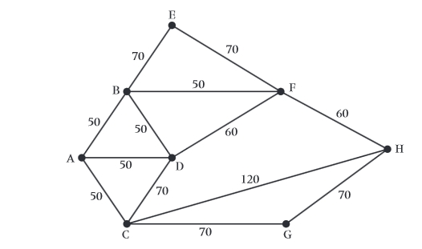
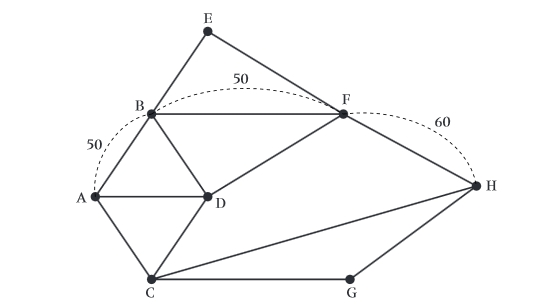
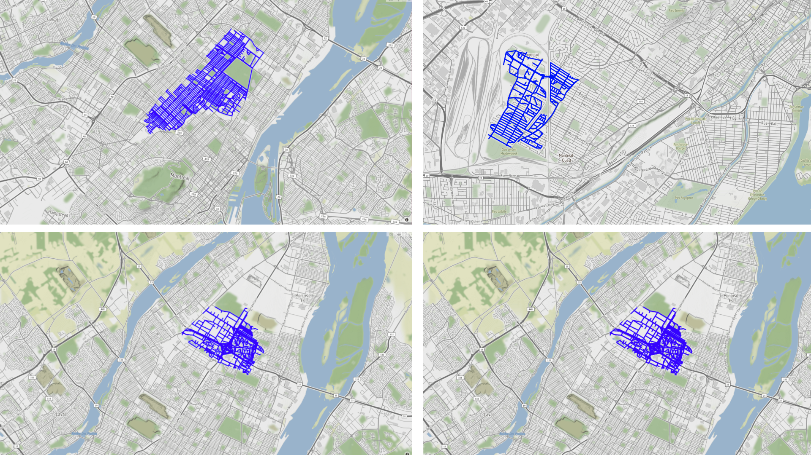

# Resolution method

In order to solve Montreal's snow removal problem, we have implemented an iterative attack strategy. Indeed, we have identified sub-problems that are solvable with increasing difficulty, first on the theoretical side and then on the practical side.

# Theoretical

First, we took a theoretical approach. We focused on solving the Chinese Postman Problem, given its resemblance to the snow removal in Montreal (visiting all the streets of a city). The studied graphs were undirected and weighted.

Initially, we examined the trivial case of an Eulerian graph (without vertices of odd degree). The solution, of course, was to find an Eulerian cycle. The subsequent resolution of the problem involved making the studied graph Eulerian. We solved the case where only two vertices had odd degrees. The solution was to duplicate the edges on the shortest path between these vertices to minimize the cost of the final cycle.

Finally, in the general case, we identified vertices of odd degree. The same process will be carried out on pairs of vertices to make the graph Eulerian. The minimization of the weight of the edges to be added was done through a perfect matching of minimum weight.

However, the theoretical solution obtained quickly showed its limitations when applied to a real case. Firstly, using a directed graph is necessary to represent a city. Additionally, the larger size of the graphs to be studied raised optimization problems, especially during the matching of vertices.

For non-Eulerian graphs, we first need to make them Eulerian before applying the same method. This is where the difficulty is added; to make a graph Eulerian, we had to use a Dijkstra's algorithm to generate the shortest paths between nodes of odd degree.

The most complex part was generating the combination of pairs of these odd-degree nodes with minimum weight before being able to reintegrate them into our graph. An implementation based on an adjacency list greatly helped us with graph traversal.

# Practical

The practical part must take into account the limitations of real-time usage. As a result, algorithms that offer the best route could have been replaced by an algorithm with a shorter computation time but less optimized traversal. Nevertheless, we focused on an optimal route that is divided into several small sub-routes to achieve a reasonable time.

To retrieve road maps, we used osmnx, based on the OpenStreetMap database. We began by breaking down the snow removal in Montreal into several small sub-problems:

1. Get osmnx up and running and load a small town onto it.
2. Learn about the osmnx framework by reading the documentation.
3. Research the state of the art of the Chinese Postman: The GitHub repository https://github.com/matejker/everystreet seemed to meet our expectations.  Unfortunately, after testing to try to run this GitHub, it turns out it uses another package that uses an old version of networkx.  

After this unsuccessful attempt to use a pre-built program, we decided to look at a blog that explained the Chinese Postman in a real-world case with osmnx. It separated the Chinese Postman problem into four major steps:

1. Find all nodes with odd degree.
2. Add edges to the graph so that all nodes of odd degree become even.
3. Given a starting point, find the Eulerian tour over the entire augmented data.
4. Then calculate the route from start to finish.

Now that we understood how to implement the Chinese Postman, we wondered how we would use it for the entire Montreal. We focused on snow removal by borough, as Montreal is divided into 19 boroughs, each responsible for urban planning. It seemed more logical to separate Montreal by borough rather than using a random or arbitrary separation.

So, we chose to lean towards calculating a more optimal solution while dividing the task among the 19 boroughs.

| Name of Borough                | Hampstead                              |
| ------------------------------ | -------------------------------------- |
| Length of path                 | 76547.68 m                             |
| Length of the original map     | 26556.99 m                             |
| Length spent retracing edge    | 49990.70 m                             |
| Percent of mileage retraced    | 188.24%                                |
| Number of edges in circuit     | 571                                    |
| Number of edges in original graph | 219                                  |
| Number of nodes in original graph | 138                                  |
| Number of edges traversed more than once | 352                              |

To analyze these path length data, we researched the price of gasoline in Montreal (130 cents/Liter). The consumption in Canada for heavy vehicles like snowplows would be 40L per 100 kilometers, so 0.40L per kilometer.

We can have a mathematical formula to determine the cost for snow removal:

$$ P_e = \frac{(\text{Gasoline price in cents/Liter})}{L} \times C $$

Where:
- *Pe* is the cost of snow removal.
- *L* is the length of the path to be covered in kilometers.
- *C* is the consumption in Liters per kilometer (0.40).

The total cost for snow removal (*P*) can be calculated using the formula:
$` P = P_e \times L \times C `$

So, if we apply it to the Hampstead borough with *L = 76* km:

$$ P = 130 \times 76 \times 0.40 = 3952 \text{ cents} = 39 \text{ CAD} $$

to clear the snow in the Hampstead borough. We can even calculate the cost for revisiting roads, which does not contribute to snow removal (*L = 50* km):

$$ P = 130 \times 50 \times 0.40 = 2600 \text{ cents} = 26 \text{ CAD} $$

with, if necessary, a purchase of a snowplow costing approximately 44,000 Canadian dollars. The limitations of the solution are primarily due to attempting to achieve the optimal solution, resulting in multiple passes over the same path, and the algorithm being relatively slow.

# Sources

1. Blog explaining Chinese Postman: [DataCamp Tutorial on NetworkX in Python](https://www.datacamp.com/community/tutorials/networkx-python-graph-tutorial)

2. Gasoline Prices in Montreal: [Essence Montreal - Gas Prices](https://www.essencemontreal.com/prices.php?l=f&tab=prices&l=f&prov=QC&city=Montreal)

3. Snowplow Consumption: [Transport Canada - Annual 2014 Trucks, Tractors, Semi-Trailers, Freight Vans](https://tc.canada.ca/fr/services-generaux/politiques/annuel-2014-camions-porteurs-tracteurs-semi-remorques-fourgons-marchandise)
